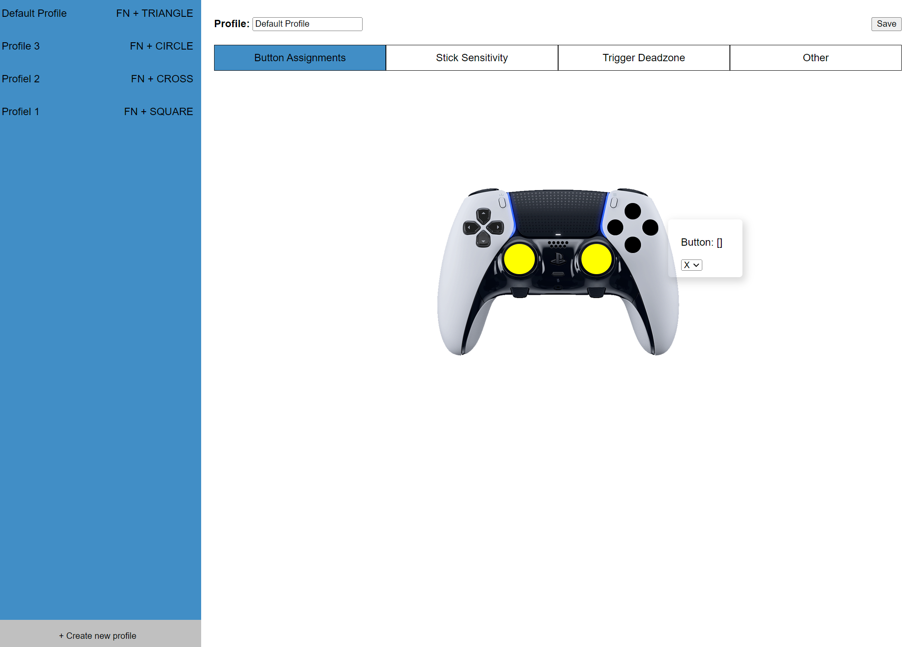

# DualSense Edge Profile Web Application

The main objective of this project is to enable profile modifications, creation, and deletion for the DualSense Edge
controller. It aims to assist users in configuring joystick inputs, button mapping, and trigger registrations without
relying on a console.

### Functionality

Currently, users can edit profiles on their DualSense Edge controller (Profile name and joystick sensitivity). Keep in
mind that it will only work by using USB protocol if you want to make changes on your Edge controller. Bluetooth will
work partially. Additional features are under development.

### Why is this app build exclusively for web browsers?

The main objective is to ensure cross-compatibility and easy accessibility of this tool. However, it currently requires
modern Chromium web browsers due to its utilization of the experimental WebHID API. To determine if your browser is
compatible, you can refer to
the [MDN web docs](https://developer.mozilla.org/en-US/docs/Web/API/WebHID_API#browser_compatibility).
